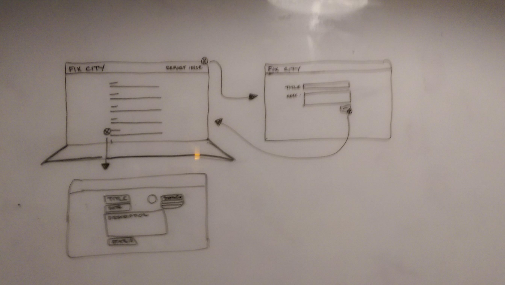

# Fix City
### A web application enabling members of the public to report civil issues to their local council

[](https://travis-ci.org/KatHicks/fix-city) [](https://coveralls.io/github/KatHicks/fix-city?branch=master) [](https://codeclimate.com/github/KatHicks/fix-city)

Built by [Kat Hicks](https://github.com/KatHicks), [Pedro Castanheira](https://github.com/pedrocastanheira77), [Enrico Graziani](https://github.com/mrenrich84), [Barbara Shinkarenk](https://github.com/varvarra), [Samir Gossain](https://github.com/sim-ware) and [Ben Kielty](https://github.com/bwk103) in 5 days as a practice project at Makers Academy

### Instructions

> You'll spend this week working in teams on a project. You'll generate some project ideas (eg "Build a scheme compiler", or "Make a game".) You'll each choose which projects you'd prefer to work on. Your coach will try to assign you to a team that will work on one of your preferred projects.
>
> It will be a one week version of the final projects.

### User stories

As a group, we developed the following user stories that defined our goals for the project as well as what we considered to be the minimum viable product (MVP)

**MVP**

```
As a user,
so that it can dealt with by the council,
I want to be able to create an issue.

As a user,
so that I can manage my issues,
I want to see a list of all of my reported issues.

As a user,
so that I can see what needs to be done,
I want to see all the details of an issue.

As a user,
so that citizens get feedback on the result,
I want to be able to manage the status of an issue.

As a user,
so that I can correct myself,
I can update an issue that I've raised.
```

**Version 1**

```
As a user,
so that I can differentiate myself and my issues,
I can sign up.

As a user,
so that I can rectify a mistake,
I can delete issues.

As a user,
so that I can use the app,
I can sign in.

As a user,
so that my use of the app is appropriate,
I can access certain parts of the web app based on my credentials.

As a user,
so that I can provide the information to the appropriate Council worker,
I can add tags when reporting or editing my issue.

As a user,
so that I can see only the issues relevant to me,
I can filter the issues by tag.

As a council staff member,
so that citizens get feedback on the result,
I want to be able to manage the status of an issue.

As a citizen,
so that it's clear what the problem is,
I want to be able to upload a photo with my issue.

As a citizen,
so that it is easier to report an issue,
I want the app to know my current location.
```

### Objectives

* Are you having fun?
* Are you a better developer than you were yesterday?
* **Can you use high-quality processes to build a project in a team?**

### Using our app

* You can view our app at [fix-city.herokuapp.com](https://fix-city.herokuapp.com/)

### Running the tests

* If you do not have PostgreSQL installed, you will need to install it using the command `$ brew install postgresql`
* You will also need to install Rails, Bundler and Imagemagick using the following commands:
  * `$ gem install rails`
  * `$ gem install bundler`
  * `$ brew install imagemagick`
* Next, download the source code by cloning this repo with `$ git clone`
* Navigate into the root of the directory using `$ cd fix-city`
* Run `$ bundle install`, then `$ bin/rake db:create` and `$ bin/rake db:migrate` in the command line
* Now that everything is set up, run `$ rspec` in the command line to run the tests

## Approach

Citizens are able to report different types of non-emergency problems such as:

  * Potholes
  * Broken street or sign lighting
  * Worn or cracked road surfaces
  * Traffic signal faults
  * Unstable pavements
  * Overgrown trees and vegetation
  * Blocked drains
  * Flooding

#### Planning & Design

Our overarching goal for this project was to design an application which would enable concerned citizens to quickly and efficiently notify their local council of non-emergency problems and issues.  At the outset of the design stage, we first debated the functionality required of a minimum viable product (MVP) and concluded that it should include the abilities to report, view and edit issues.


We decided at an early stage that the most appropriate technology to use in creating our application would be Ruby on Rails and that we would implement Google Maps functionality using the Google Maps Javascript API.

In order to form a shared vision of the final application we produced a series of mockup images, showing the functionality of each page of the application.




#### Development

We split into three groups of two and assigned each pair an aspect of the project to research and develop.  One group was assigned to the underlying scaffold, structure and views of the rails environment, another to a feature permitting the uploading of user photos, and the final pair to the addition of Google Maps across the application.

Daily standups were held at which any problems encountered by the pairs were addressed and any instances of particularly unusual or complex code were shared.

#### Using the App

Index view showing all previous issues:


#### Outcome

At the conclusion of the project, we have produced an application which meets its overriding specification (that of reporting issues), includes a number of additional features and possesses an attractive user-interface.


### Installation

This project uses Ruby on Rails version 5.0.1 (http://rubyonrails.org) and Ruby version 2.3.3.

  * git clone/fork this repository

  * $ gem install rails

  * $ gem install bundler

  * $ brew install imagemagick

  * $ bundle install

  * $ bin/rake db:create

  * $ bin/rake db:migrate

  * $ bin/rails s

  * Open http://localhost:3000/ in your browser in order to access the app


### Testing framework

This project was tested using Rspec and Capybara.  In order to run and view the tests, run '$ rspec' from the command line.

### Services

The application uses Google Maps Javascript API (https://developers.google.com/maps/documentation/javascript/) in order to access and present map, marker and geolocation information.

To style the maps we used the 'Pale Dawn' theme by Adam Krogh (https://snazzymaps.com/style/1/pale-dawn) and the 'Map Marker 2' iconset from 'iconsdb.com'.

### Future Updates

Going forward, we would like to add functionality to address the following user stories:

```
As a citizen
I want to receive notifications when the status of my issue is changed
so that I know as soon as the Council has resolved the issue.

As a user
I want to have a profile page
so that I can see my user information and reported issue history

As a user
I want to receive 'badges'
so that I can demonstrate the number of times I've reported issues

As a user
I want to use a 'live chat' feature
so that I can discuss an issue with a Council staff member in real time

As a Council staff member
I want to add council boundaries as a layer to the maps
so that any reported issues can be automatically forwarded to the appropriate Council.
```
